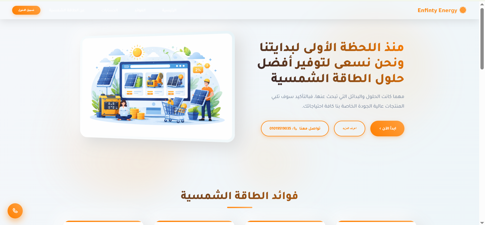

# ☀️ Solar E‑Commerce Platform

A modern Arabic **Solar Energy E‑commerce Website** built to showcase and sell solar products with a clean UI and clear business presentation.



---

## 🚀 Features

* 🛒 Solar products showcase (Panels, Inverters, Accessories)
* 🌞 Professional landing page for solar companies
* 📱 Fully responsive design
* 🌍 Arabic RTL layout
* 🎨 Modern UI/UX
* 📞 Quick contact actions

---

## 🧰 Tech Stack

### Frontend

* **HTML5**
* **CSS3**
* **Bootstrap**
* **JavaScript**

### Backend

* **PHP (Native)**
* **MySQL**

---

## 📂 Project Structure

````bash
Solar-ecommerce/
│
├── assets/           # Images & icons
├── css/              # Stylesheets
├── js/               # JavaScript files
├── database/         # Database connection
├── Controls/         # Backend controllers (CRUD)
├── views/            # Pages & templates
├── index.html        # Landing page
└── README.md
```bash
Solar-ecommerce/
│
├── assets/          # Images & icons
├── css/             # Stylesheets
├── js/              # JavaScript files
├── index.html       # Main page
└── README.md
````

---

## 🖼️ Screenshots

> Make sure the image exists in `assets/preview.png`


---

## ⚙️ Installation & Usage

1. Clone the repository

```bash
git clone https://github.com/memo4code2/Solar-ecommerce.git
```

2. Open the project folder

```bash
cd Solar-ecommerce
```

3. Open `index.html` in your browser

---

## 📌 Future Improvements

* 🛒 Complete product management (CRUD)
* 🔐 Authentication & authorization
* 🧑‍💼 Admin dashboard
* 💳 Online payment integration
* 🚀 Migration to Laravel

---

## 👨‍💻 Author

**Mohamed**

* GitHub: [memo4code2](https://github.com/memo4code2)

---

## ⭐ Support

If you like this project, don’t forget to **star the repo ⭐**

---

> Built with ❤️ for clean energy & modern web development
